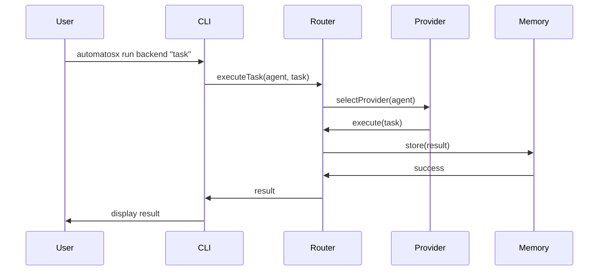

# AutomatosX v4.0 Documentation Plan

## Executive Summary

Documentation is a **first-class deliverable** for AutomatosX v4.0, not an afterthought. This plan ensures comprehensive, high-quality documentation that enables users to successfully adopt and leverage the platform while supporting maintainers and contributors.

**Documentation Goals**:
- **User Success**: < 5 minutes from install to first agent run
- **Completeness**: 100% API coverage, all features documented
- **Quality**: User-tested, technically accurate, well-organized
- **Maintainability**: Automated generation, version-controlled, easy to update

**Key Deliverables**:
1. User documentation (guides, tutorials, examples)
2. API documentation (TypeDoc-generated reference)
3. Developer documentation (architecture, contributing)
4. Migration documentation (v3.x → v4.0 upgrade guide)
5. Video tutorials (optional, Phase 4)

---

## 1. Documentation Strategy

### 1.1 Documentation as Code

**Principles**:
- Documentation lives in version control alongside code
- Documentation changes reviewed in pull requests
- Documentation built and deployed automatically
- Broken links and outdated examples fail CI

**Benefits**:
- Documentation stays in sync with code
- Community can contribute documentation
- Documentation versioned with releases
- Easy to rollback documentation with code

### 1.2 Progressive Disclosure

**Approach**:
- **Quick Start**: Get users running in < 5 minutes
- **Guides**: Task-based documentation for common scenarios
- **Reference**: Complete API documentation for deep dives
- **Advanced**: Architecture and internals for contributors

**User Journey**:
```
Quick Start (5 min)
    ↓
Tutorials (30 min)
    ↓
Guides (as needed)
    ↓
Reference (deep dive)
    ↓
Architecture (contribute)
```

### 1.3 Audience Segmentation

| Audience | Primary Needs | Documentation Type |
|----------|--------------|-------------------|
| **New Users** | Quick start, basic concepts | Getting Started, Tutorials |
| **Regular Users** | Task guides, CLI reference | User Guides, CLI Reference |
| **Advanced Users** | Configuration, optimization | Advanced Guides, Best Practices |
| **Developers** | API reference, architecture | API Docs, Architecture Guide |
| **Contributors** | Development setup, guidelines | Contributing Guide, Code Standards |
| **Migrators** | v3.x → v4.0 migration | Migration Guide, Breaking Changes |

### 1.4 Quality Metrics

**Documentation Quality Targets**:

| Metric | Target | Measurement Method |
|--------|--------|-------------------|
| **API Coverage** | 100% | TypeDoc coverage report |
| **Code Examples** | 100% working | Automated example testing |
| **User Completion Rate** | > 80% complete Quick Start | Telemetry (opt-in) |
| **Support Tickets** | < 10% doc-related | Support ticket categorization |
| **Documentation Bugs** | < 5 open issues | GitHub issue tracking |
| **Search Success** | > 70% find answer | Documentation analytics |
| **Time to Answer** | < 2 min average | User testing |

**Tracking**:
- Monthly documentation health report
- Quarterly user satisfaction survey
- CI/CD metrics for doc build health

---

## 2. Documentation Types

### 2.1 User Documentation

#### 2.1.1 Getting Started

**File**: `docs/getting-started.md`

**Contents**:
1. **Installation** (2 minutes)
   ```bash
   npm install -g automatosx
   automatosx init
   ```

2. **Provider Setup** (2 minutes)
   - Claude Code setup
   - Gemini CLI setup
   - OpenAI CLI setup

3. **First Agent Run** (1 minute)
   ```bash
   automatosx run backend "Create a REST API for user authentication"
   ```

4. **Next Steps**
   - Link to tutorials
   - Link to agent gallery
   - Link to configuration guide

**Success Criteria**:
- User runs first agent successfully in < 5 minutes
- 90%+ users complete without errors
- Clear error messages for common issues

#### 2.1.2 Tutorials

**Location**: `docs/tutorials/`

**Core Tutorials**:
1. **Tutorial 1: Your First Agent** (10 min)
   - Create custom agent profile
   - Configure abilities
   - Run agent on real task
   - Review results in memory

2. **Tutorial 2: Multi-Agent Workflow** (15 min)
   - Design sequential workflow
   - Design parallel workflow
   - Handle dependencies
   - Aggregate results

3. **Tutorial 3: Memory & Context** (10 min)
   - Store agent results
   - Search memory
   - Use memory in new tasks
   - Manage memory lifecycle

4. **Tutorial 4: Advanced Configuration** (15 min)
   - Provider priority and routing
   - Rate limiting and retry policies
   - Logging configuration
   - Workspace management

5. **Tutorial 5: Creating Abilities** (10 min)
   - Write markdown abilities
   - Organize ability files
   - Share abilities across agents
   - Version ability templates

**Format**:
- Step-by-step instructions
- Code examples (copy-pasteable)
- Screenshots (where helpful)
- Expected output shown
- Troubleshooting section

#### 2.1.3 User Guides

**Location**: `docs/guides/`

**Task-Based Guides**:
1. **Agent Management**
   - Creating custom agents
   - Modifying built-in agents
   - Agent profile schema reference
   - Agent best practices

2. **Provider Configuration**
   - Adding new providers
   - Provider priority and fallback
   - Provider-specific settings
   - Cost optimization

3. **Memory System**
   - Memory search strategies
   - Memory cleanup and maintenance
   - Export/import memory
   - Memory backup strategies

4. **Workflow Design**
   - Sequential workflows
   - Parallel workflows
   - Conditional workflows
   - Error handling in workflows

5. **Configuration**
   - Configuration file reference
   - Environment variables
   - Per-project configuration
   - Configuration validation

6. **Troubleshooting**
   - Common errors and solutions
   - Debug mode
   - Log analysis
   - Health checks

#### 2.1.4 CLI Reference

**File**: `docs/cli-reference.md`

**Auto-generated** from Yargs commands + manual annotations

**Contents**:
- Complete command reference
- All flags and options
- Examples for each command
- Exit codes
- Environment variables

**Example Entry**:
```markdown
### `automatosx run <agent> <task>`

Execute a task using the specified agent.

**Arguments**:
- `<agent>` - Agent role name (e.g., backend, frontend, security)
- `<task>` - Task description or instruction

**Options**:
- `--provider <name>` - Force specific provider
- `--no-memory` - Disable memory storage
- `--workspace <path>` - Custom workspace directory
- `--stream` - Stream output in real-time
- `--verbose` - Enable verbose logging

**Examples**:
```bash
# Run backend agent with task
automatosx run backend "Design authentication API"

# Run with specific provider
automatosx run frontend "Create login form" --provider claude-code

# Run without storing in memory
automatosx run security "Review code" --no-memory
```

**Exit Codes**:
- 0: Success
- 1: General error
- 2: Provider error
- 3: Configuration error
```

### 2.2 API Documentation

#### 2.2.1 TypeDoc Generation

**Tool**: TypeDoc (automated)

**Configuration**: `typedoc.json`
```json
{
  "entryPoints": ["src/index.ts"],
  "out": "docs/api",
  "plugin": ["typedoc-plugin-markdown"],
  "excludePrivate": true,
  "excludeInternal": true,
  "readme": "docs/api-overview.md",
  "categorizeByGroup": true,
  "includeVersion": true
}
```

**Coverage Requirements**:
- 100% public APIs documented
- All parameters described
- Return types documented
- Examples for complex APIs
- Links to related concepts

**Documentation Standards** (TSDoc):
```typescript
/**
 * Execute a task using the specified agent.
 *
 * This method orchestrates the complete task execution flow:
 * 1. Loads agent profile and abilities
 * 2. Selects appropriate provider based on availability
 * 3. Creates execution context with memory
 * 4. Executes task via provider
 * 5. Stores result in memory
 *
 * @param agent - Agent role name or profile object
 * @param task - Task description or instruction
 * @param options - Execution options
 * @returns Promise resolving to execution result
 *
 * @throws {AgentNotFoundError} If agent profile doesn't exist
 * @throws {ProviderUnavailableError} If no providers available
 * @throws {ExecutionError} If task execution fails
 *
 * @example
 * ```typescript
 * const result = await router.executeTask({
 *   agent: 'backend',
 *   task: 'Design user authentication API',
 *   options: { memory: true }
 * });
 * console.log(result.content);
 * ```
 *
 * @see {@link Router.executeWorkflow} for multi-agent workflows
 * @see {@link Provider.execute} for provider execution details
 */
async executeTask(
  agent: string | AgentProfile,
  task: string,
  options?: ExecutionOptions
): Promise<ExecutionResult> {
  // Implementation
}
```

#### 2.2.2 API Overview

**File**: `docs/api-overview.md`

**Contents**:
1. **Architecture Overview**
   - System diagram
   - Component relationships
   - Data flow

2. **Core APIs**
   - Router API
   - Memory API
   - Agent API
   - Provider API

3. **Usage Patterns**
   - Common scenarios
   - Best practices
   - Anti-patterns to avoid

4. **Error Handling**
   - Error types
   - Error recovery
   - Retry strategies

### 2.3 Developer Documentation

#### 2.3.1 Architecture Guide

**File**: `docs/architecture.md`

**Contents**:
1. **System Architecture**
   - High-level architecture diagram
   - Component breakdown
   - Layer responsibilities
   - Design principles

2. **Core Components**
   - CLI Interface Layer
   - Orchestration Layer (Router, Workflow, Memory)
   - Agent Layer (Loader, Abilities, Context)
   - Provider Layer

3. **Data Flow**
   - Request lifecycle
   - Memory storage flow
   - Provider selection flow
   - Error handling flow

4. **Design Decisions**
   - Technology choices (why TypeScript, Vitest, etc.)
   - Architecture patterns (why 2-layer memory, enhanced provider)
   - Trade-offs made

5. **Extension Points**
   - Custom providers
   - Custom agents
   - Plugin system
   - Middleware hooks

#### 2.3.2 Contributing Guide

**File**: `CONTRIBUTING.md` (root)

**Contents**:
1. **Getting Started**
   - Development environment setup
   - Running tests
   - Running in development mode

2. **Development Workflow**
   - Branch naming convention
   - Commit message format (Conventional Commits)
   - Pull request process
   - Code review guidelines

3. **Code Standards**
   - TypeScript style guide
   - ESLint configuration
   - Testing requirements (80% coverage)
   - Documentation requirements

4. **Testing Guide**
   - Unit testing with Vitest
   - Integration testing
   - E2E testing
   - Running specific test suites

5. **Documentation**
   - Documentation standards
   - How to update docs
   - API documentation (TSDoc)
   - Example testing

6. **Release Process**
   - Version numbering (semver)
   - Release checklist
   - Changelog generation

**Example Section**:
```markdown
## Development Setup

1. Clone the repository:
   ```bash
   git clone https://github.com/your-org/automatosx.git
   cd automatosx
   ```

2. Install dependencies:
   ```bash
   npm install
   ```

3. Run in development mode:
   ```bash
   npm run dev
   ```

4. Run tests:
   ```bash
   npm test                # All tests
   npm run test:unit       # Unit tests only
   npm run test:watch      # Watch mode
   npm run test:coverage   # With coverage
   ```

5. Build project:
   ```bash
   npm run build
   ```

## Code Standards

- **Language**: TypeScript (strict mode)
- **Style**: Prettier (auto-format on commit)
- **Linting**: ESLint (must pass before commit)
- **Testing**: Vitest (80%+ coverage required)
- **Documentation**: TSDoc for all public APIs

## Commit Messages

Follow Conventional Commits:

```
feat: add streaming support to provider API
fix: resolve memory corruption on concurrent writes
docs: update API reference for Router class
test: add integration tests for workflow engine
refactor: simplify provider selection logic
```
```

#### 2.3.3 Code Standards

**File**: `docs/code-standards.md`

**Contents**:
1. **TypeScript Standards**
   - Type safety rules
   - Interface vs Type
   - Generic usage
   - Async/await patterns

2. **Code Organization**
   - File structure
   - Module boundaries
   - Dependency injection
   - Error handling patterns

3. **Testing Standards**
   - Test file organization
   - Test naming convention
   - Mock strategies
   - Fixture management

4. **Performance Guidelines**
   - Async patterns
   - Memory management
   - Caching strategies
   - Profiling tools

### 2.4 Migration Documentation

#### 2.4.1 Migration Guide (v3.x → v4.0)

**File**: `docs/migration-v3-to-v4.md`

⚠️ **CRITICAL**: This is the most important document for existing users

**Contents**:

1. **Overview**
   - Why upgrade to v4.0?
   - Breaking changes summary
   - Migration time estimate
   - Rollback procedure

2. **Before You Migrate**
   - Backup checklist
   - Compatibility check
   - System requirements
   - Provider prerequisites

3. **Automatic Migration**
   ```bash
   npm install automatosx@4
   # Automatic migration wizard runs
   # Follow prompts to migrate
   ```

4. **Manual Migration Steps**

   **Step 1: Backup v3.x** (5 min)
   ```bash
   # Automatic backup created at:
   ~/.automatosx-v3-backup/
   ```

   **Step 2: Configuration Migration** (10 min)
   - YAML → JSON conversion
   - Updated provider format
   - New memory configuration
   - Workspace configuration

   **Step 3: Agent Profile Migration** (15 min)
   - Profile schema changes
   - Ability file updates
   - Workflow format updates

   **Step 4: Memory Migration** (time varies by size)
   - Legacy vector DB → SQLite + vec migration
   - Embedding regeneration
   - Validation

   **Step 5: Verification** (10 min)
   ```bash
   automatosx health          # Health check
   automatosx agent list      # Verify agents
   automatosx memory search "test"  # Verify memory
   ```

5. **Breaking Changes**

   | Change | v3.x | v4.0 | Migration Action |
   |--------|------|------|-----------------|
   | Config Format | YAML | JSON | Auto-converted |
   | Config Location | `automatosx.config.yaml` | `automatosx.config.json` | Auto-renamed |
   | Runtime Directory | `.defai/` | `.automatosx/` | Auto-migrated |
   | Vector DB | Legacy | SQLite + vec/vss | Auto-migrated |
   | CLI Commands | `defai` | `automatosx` | Aliases provided |
   | Memory API | 3-layer | 2-layer | Compatible |

6. **Compatibility Layer**
   - v3.x command aliases (6 months)
   - Config format detection (automatic)
   - Data migration (automatic)

7. **Troubleshooting Migration**
   - Common migration errors
   - Data corruption recovery
   - Rollback procedure
   - Support resources

8. **Rollback Procedure**
   ```bash
   # If migration fails or issues found
   npx automatosx rollback

   # Restores from automatic backup:
   # - v3.x configuration
   # - v3.x memory data
   # - v3.x agent profiles
   ```

#### 2.4.2 Breaking Changes Log

**File**: `docs/breaking-changes-v4.md`

**Contents**:
- Detailed breaking changes
- Code migration examples
- API deprecations
- Removed features
- Changed behaviors

**Example Entry**:
```markdown
### Memory API: `search()` method signature changed

**v3.x**:
```typescript
memory.search(query: string, filters?: MemoryFilter): Promise<MemoryEntry[]>
```

**v4.0**:
```typescript
memory.search(query: string, options?: SearchOptions): Promise<MemoryEntry[]>
```

**Migration**:
```typescript
// v3.x code
const results = await memory.search('authentication', {
  agent: 'backend',
  limit: 5
});

// v4.0 equivalent
const results = await memory.search('authentication', {
  filter: { agent: 'backend' },
  limit: 5
});
```

**Reason**: Unified options pattern, clearer separation of filters and options
```

---

## 3. Documentation Structure

### 3.1 File Organization

```
docs/
├── index.md                          # Documentation home
├── getting-started.md                # Quick start guide
├── installation.md                   # Detailed installation
├── migration-v3-to-v4.md            # Migration guide (CRITICAL)
│
├── tutorials/                        # Step-by-step tutorials
│   ├── 01-first-agent.md
│   ├── 02-multi-agent-workflow.md
│   ├── 03-memory-and-context.md
│   ├── 04-advanced-configuration.md
│   └── 05-creating-abilities.md
│
├── guides/                           # Task-based guides
│   ├── agents/
│   │   ├── creating-agents.md
│   │   ├── agent-profiles.md
│   │   └── agent-best-practices.md
│   ├── providers/
│   │   ├── provider-setup.md
│   │   ├── provider-configuration.md
│   │   └── provider-optimization.md
│   ├── memory/
│   │   ├── memory-overview.md
│   │   ├── memory-search.md
│   │   └── memory-maintenance.md
│   ├── workflows/
│   │   ├── workflow-design.md
│   │   ├── sequential-workflows.md
│   │   └── parallel-workflows.md
│   └── configuration/
│       ├── config-reference.md
│       ├── environment-variables.md
│       └── advanced-config.md
│
├── reference/                        # Reference documentation
│   ├── cli-reference.md             # CLI command reference
│   ├── config-schema.md             # Config file schema
│   ├── agent-schema.md              # Agent profile schema
│   └── error-codes.md               # Error code reference
│
├── api/                             # API documentation (auto-generated)
│   ├── index.md                     # API overview
│   ├── classes/                     # Class documentation
│   ├── interfaces/                  # Interface documentation
│   └── modules/                     # Module documentation
│
├── advanced/                        # Advanced topics
│   ├── architecture.md              # System architecture
│   ├── performance.md               # Performance tuning
│   ├── security.md                  # Security considerations
│   ├── extending.md                 # Extension guide
│   └── internals.md                 # Internal implementation
│
├── contributing/                    # Contribution docs
│   ├── getting-started.md           # Dev environment setup
│   ├── code-standards.md            # Coding standards
│   ├── testing.md                   # Testing guide
│   ├── documentation.md             # Documentation guide
│   └── release-process.md           # Release procedures
│
└── troubleshooting/                 # Troubleshooting
    ├── common-errors.md             # Common errors
    ├── debugging.md                 # Debugging guide
    ├── faq.md                       # FAQ
    └── support.md                   # Getting support
```

### 3.2 Documentation Website Structure

**Site Navigation**:

```
Home
├── Getting Started
│   ├── Installation
│   ├── Quick Start
│   └── Migration from v3.x ⚠️
│
├── Tutorials
│   ├── First Agent
│   ├── Multi-Agent Workflow
│   ├── Memory & Context
│   ├── Advanced Configuration
│   └── Creating Abilities
│
├── Guides
│   ├── Agents
│   ├── Providers
│   ├── Memory
│   ├── Workflows
│   └── Configuration
│
├── Reference
│   ├── CLI Reference
│   ├── API Reference
│   ├── Configuration Schema
│   └── Error Codes
│
├── Advanced
│   ├── Architecture
│   ├── Performance
│   ├── Security
│   └── Extending
│
└── Community
    ├── Contributing
    ├── Code Standards
    ├── Troubleshooting
    └── Support
```

---

## 4. Documentation Tooling

### 4.1 Static Site Generator

**Choice**: **VitePress** (recommended) or Docusaurus

#### Option A: VitePress (Recommended)

**Pros**:
- Fast (Vite-powered)
- Markdown-focused
- Vue 3 components
- Excellent search
- TypeScript support
- Lightweight

**Cons**:
- Smaller ecosystem than Docusaurus
- Fewer plugins

**Configuration**: `docs/.vitepress/config.ts`
```typescript
export default {
  title: 'AutomatosX',
  description: 'AI Agent Orchestration Platform',

  themeConfig: {
    nav: [
      { text: 'Guide', link: '/getting-started' },
      { text: 'API', link: '/api/' },
      { text: 'Migration', link: '/migration-v3-to-v4' }
    ],

    sidebar: {
      '/guides/': [
        { text: 'Agents', items: [...] },
        { text: 'Providers', items: [...] },
        { text: 'Memory', items: [...] }
      ]
    },

    search: {
      provider: 'local'
    }
  }
}
```

#### Option B: Docusaurus

**Pros**:
- Feature-rich
- Large plugin ecosystem
- Versioning built-in
- i18n support
- React components

**Cons**:
- Heavier
- Slower build times
- More complex setup

**Decision Point**: Sprint 13 (evaluate based on requirements)

### 4.2 API Documentation Generator

**Tool**: **TypeDoc**

**Installation**:
```bash
npm install -D typedoc typedoc-plugin-markdown
```

**Configuration**: `typedoc.json`
```json
{
  "entryPoints": ["src/index.ts"],
  "out": "docs/api",
  "plugin": ["typedoc-plugin-markdown"],
  "theme": "markdown",
  "readme": "none",
  "excludePrivate": true,
  "excludeInternal": true,
  "categorizeByGroup": true,
  "groupOrder": [
    "Core",
    "Agents",
    "Providers",
    "Memory",
    "Utilities"
  ]
}
```

**Generation Script**: `package.json`
```json
{
  "scripts": {
    "docs:api": "typedoc",
    "docs:build": "npm run docs:api && vitepress build docs",
    "docs:dev": "vitepress dev docs",
    "docs:preview": "vitepress preview docs"
  }
}
```

### 4.3 Example Testing

**Tool**: Vitest + Custom Example Runner

**Purpose**: Ensure all code examples in documentation work

**Implementation**:

```typescript
// tests/docs/example-runner.test.ts
import { describe, it, expect } from 'vitest';
import { extractExamples } from './extract-examples';
import { executeExample } from './execute-example';

describe('Documentation Examples', () => {
  const examples = extractExamples('docs/**/*.md');

  examples.forEach((example) => {
    it(`should execute: ${example.file}:${example.line}`, async () => {
      const result = await executeExample(example.code);
      expect(result.success).toBe(true);
    });
  });
});
```

**Extract Examples**:
```typescript
// Extract all code blocks marked as executable
import { glob } from 'glob';
import { readFile } from 'fs/promises';

export async function extractExamples(pattern: string) {
  const files = await glob(pattern);
  const examples = [];

  for (const file of files) {
    const content = await readFile(file, 'utf-8');
    const codeBlocks = content.matchAll(/```(?:typescript|javascript)\n(.*?)\n```/gs);

    for (const [, code] of codeBlocks) {
      if (!code.includes('// example')) continue;
      examples.push({ file, code });
    }
  }

  return examples;
}
```

### 4.4 Link Checking

**Tool**: markdown-link-check

**CI Integration**: `.github/workflows/docs.yml`
```yaml
name: Documentation

on:
  pull_request:
    paths:
      - 'docs/**'
      - 'src/**/*.ts'

jobs:
  check-links:
    runs-on: ubuntu-latest
    steps:
      - uses: actions/checkout@v3

      - name: Check Markdown Links
        uses: gaurav-nelson/github-action-markdown-link-check@v1
        with:
          use-quiet-mode: 'yes'
          config-file: '.github/markdown-link-check.json'

  test-examples:
    runs-on: ubuntu-latest
    steps:
      - uses: actions/checkout@v3
      - uses: actions/setup-node@v3
        with:
          node-version: 20

      - run: npm ci
      - run: npm run test:docs-examples

  build-docs:
    runs-on: ubuntu-latest
    steps:
      - uses: actions/checkout@v3
      - uses: actions/setup-node@v3

      - run: npm ci
      - run: npm run docs:build

      - name: Upload docs artifact
        uses: actions/upload-artifact@v3
        with:
          name: documentation
          path: docs/.vitepress/dist
```

### 4.5 Documentation Search

**Tool**: Built-in VitePress search (local) or Algolia DocSearch (hosted)

**Local Search** (VitePress):
```typescript
// .vitepress/config.ts
export default {
  themeConfig: {
    search: {
      provider: 'local',
      options: {
        detailedView: true
      }
    }
  }
}
```

**Algolia DocSearch** (for production):
```typescript
export default {
  themeConfig: {
    search: {
      provider: 'algolia',
      options: {
        appId: 'YOUR_APP_ID',
        apiKey: 'YOUR_API_KEY',
        indexName: 'automatosx'
      }
    }
  }
}
```

---

## 5. Writing Guidelines

### 5.1 Tone and Style

**Voice**:
- **Professional** but **approachable**
- **Clear** and **concise**
- **Action-oriented** (use imperatives: "Install", "Run", "Configure")
- **User-focused** (address user directly: "You can...")

**Style Guide**:
- Use active voice: "Run the command" (not "The command should be run")
- Use present tense: "The agent executes" (not "The agent will execute")
- Use simple language (avoid jargon where possible)
- Define acronyms on first use
- Use examples liberally

**Examples**:

❌ **Bad**:
```
The memory subsystem can be utilized to store the results of agent executions
which may subsequently be retrieved for contextual enhancement of future tasks.
```

✅ **Good**:
```
Store agent results in memory to provide context for future tasks.

Example:
```bash
automatosx run backend "Create API"  # Result stored automatically
automatosx run security "Review API" # Uses previous result as context
```
```

### 5.2 Code Examples

**Standards**:
1. **Complete and Runnable**: Every example should work as-is
2. **Commented**: Explain non-obvious parts
3. **Realistic**: Use real-world scenarios
4. **Progressive**: Start simple, add complexity gradually

**Format**:
```typescript
// ✅ Good Example: Complete, commented, realistic

// Configure the router with provider priority
const router = new Router({
  providers: [
    {
      name: 'claude-code',
      enabled: true,
      priority: 1,        // Try Claude first
      timeout: 120000
    },
    {
      name: 'gemini-cli',
      enabled: true,
      priority: 2,        // Fallback to Gemini
      timeout: 180000
    }
  ],
  retryPolicy: {
    maxAttempts: 3,
    initialDelayMs: 1000,
    backoffMultiplier: 2
  }
});

// Execute task with automatic provider selection
const result = await router.executeTask({
  agent: 'backend',
  task: 'Design user authentication API with JWT',
  context: {
    memory: true,         // Store result in memory
    workspace: true       // Isolate workspace
  }
});

console.log(result.content);
```

### 5.3 Formatting Conventions

**Headings**:
- H1: Document title only
- H2: Major sections
- H3: Subsections
- H4: Specific topics
- Don't skip levels

**Lists**:
- Use bullets for unordered items
- Use numbers for sequential steps
- Use consistent punctuation

**Code Blocks**:
- Specify language: ````typescript`, ````bash`, ````json`
- Include filename when relevant: ````typescript:src/index.ts`
- Use syntax highlighting
- Keep examples < 30 lines (split if longer)

**Tables**:
- Use for structured comparisons
- Keep columns < 5 for readability
- Include header row
- Align content consistently

**Callouts**:
```markdown
> **Note**: This is informational

> **Warning**: This is cautionary

> **Tip**: This is a helpful suggestion

> **Important**: This is critical information
```

### 5.4 Screenshot and Diagram Guidelines

**Screenshots**:
- Use sparingly (text is better for accessibility and searchability)
- Provide alt text
- Show full context (don't crop heavily)
- Update when UI changes
- Use standard terminal color scheme

**Diagrams**:
- Use Mermaid for flowcharts and sequence diagrams
- Keep diagrams simple (< 10 nodes)
- Use consistent styling
- Provide text description

**Example Diagram**:
```markdown
## Request Lifecycle

The following diagram shows how AutomatosX processes a task request:



Text description: The user invokes the CLI, which calls the Router to execute
the task. The Router selects an appropriate Provider, executes the task, stores
the result in Memory, and returns it to the user via the CLI.
```

---

## 6. Maintenance Strategy

### 6.1 Documentation Ownership

**Model**: **Distributed Ownership**

| Documentation Type | Primary Owner | Reviewers |
|-------------------|---------------|-----------|
| **Getting Started** | Tech Writer | Lead Dev, Product |
| **Tutorials** | Tech Writer | Dev Team |
| **User Guides** | Tech Writer | Support, Product |
| **API Docs** | Developers | Tech Writer |
| **Architecture** | Lead Dev | Architects |
| **Contributing** | Lead Dev | All Devs |
| **Migration Guide** | Lead Dev | Tech Writer |

**Review Process**:
1. Documentation PR created
2. Primary owner reviews for accuracy
3. Tech writer reviews for clarity (if not primary)
4. Two approvals required
5. Automated checks pass (links, examples, build)

### 6.2 Documentation Updates

**Triggers for Updates**:
1. **Code Changes**: API changes require doc updates in same PR
2. **Bug Fixes**: Add to troubleshooting if user-facing
3. **New Features**: Tutorial/guide required before release
4. **Breaking Changes**: Migration guide updated immediately
5. **User Feedback**: FAQ updated weekly

**PR Template** (enforces documentation):
```markdown
## Description
[Describe changes]

## Documentation Updates
- [ ] API documentation updated (if API changed)
- [ ] User guide updated (if feature added)
- [ ] Migration guide updated (if breaking change)
- [ ] Examples tested and working
- [ ] N/A - No documentation changes needed

## Checklist
- [ ] Code changes reviewed
- [ ] Tests added/updated
- [ ] Documentation added/updated
- [ ] CHANGELOG.md updated
```

### 6.3 Versioning Strategy

**Documentation Versions**: Mirror release versions

**Approach**:
```
docs/
├── v4.0/           # Current stable
├── v4.1/           # Next version (if needed)
├── v3.x/           # Previous major version (6 months support)
└── latest/         # Symlink to current stable
```

**VitePress Multi-version** (Phase 4):
```typescript
// .vitepress/config.ts
export default {
  themeConfig: {
    nav: [
      {
        text: 'v4.0',
        items: [
          { text: 'v4.0 (stable)', link: '/v4.0/' },
          { text: 'v3.x', link: '/v3.x/' },
          { text: 'Changelog', link: '/changelog' }
        ]
      }
    ]
  }
}
```

### 6.4 Deprecation Documentation

**Process**:
1. Mark feature as deprecated in code
2. Add deprecation warning to docs
3. Provide migration path
4. Set removal timeline

**Example**:
```markdown
## `memory.searchOld()` (Deprecated)

> **Deprecated**: This method is deprecated as of v4.0 and will be removed in v5.0.
> Use `memory.search()` instead.

**Migration**:
```typescript
// Old (deprecated)
const results = await memory.searchOld(query, filters);

// New (v4.0+)
const results = await memory.search(query, { filter: filters });
```

**Reason**: Unified API for better consistency.
```

---

## 7. Documentation Testing

### 7.1 Automated Testing

**What to Test**:
1. **Code Examples**: All examples execute successfully
2. **Links**: No broken internal or external links
3. **API Coverage**: 100% of public APIs documented
4. **Build**: Documentation builds without errors
5. **Formatting**: Markdown linting passes

**Test Suite**: `package.json`
```json
{
  "scripts": {
    "test:docs": "npm run test:docs:examples && npm run test:docs:links && npm run test:docs:build",
    "test:docs:examples": "vitest run tests/docs/",
    "test:docs:links": "markdown-link-check 'docs/**/*.md'",
    "test:docs:build": "vitepress build docs",
    "test:docs:coverage": "typedoc --validation.invalidLink && npm run test:docs"
  }
}
```

**CI Configuration**: `.github/workflows/docs.yml`
```yaml
name: Documentation CI

on:
  push:
    branches: [main]
  pull_request:
    paths:
      - 'docs/**'
      - 'src/**'
      - '.github/workflows/docs.yml'

jobs:
  test-docs:
    runs-on: ubuntu-latest

    steps:
      - uses: actions/checkout@v3
      - uses: actions/setup-node@v3
        with:
          node-version: 20

      - name: Install dependencies
        run: npm ci

      - name: Test code examples
        run: npm run test:docs:examples

      - name: Check links
        run: npm run test:docs:links

      - name: Build documentation
        run: npm run test:docs:build

      - name: Check API coverage
        run: npm run docs:api -- --validation

      - name: Lint markdown
        run: npx markdownlint 'docs/**/*.md'
```

### 7.2 Manual Testing

**Review Checklist**:

**Before Release**:
- [ ] All tutorials tested end-to-end
- [ ] All CLI examples executed
- [ ] All API examples compiled and run
- [ ] Migration guide tested on v3.x install
- [ ] Screenshots up-to-date
- [ ] Navigation works correctly
- [ ] Search returns relevant results
- [ ] Mobile-responsive (check on phone)
- [ ] Accessibility (screen reader test)

**User Testing**:
- [ ] 3+ new users complete Quick Start successfully
- [ ] < 5 min average completion time
- [ ] Collect feedback on unclear sections
- [ ] Update based on feedback

### 7.3 Quality Metrics Tracking

**Monthly Documentation Health Report**:

```markdown
# Documentation Health Report - October 2025

## Coverage Metrics
- API Documentation Coverage: 98% (target: 100%)
- Code Example Success Rate: 100% (target: 100%)
- Link Health: 2 broken links found (target: 0)

## Usage Metrics (from analytics)
- Total Page Views: 15,234
- Unique Visitors: 3,421
- Avg. Time on Page: 4:32
- Search Queries: 1,234
- Top Pages:
  1. Getting Started (4,521 views)
  2. CLI Reference (2,134 views)
  3. Migration Guide (1,876 views)

## User Feedback
- Documentation Issues Opened: 5
- Support Tickets (doc-related): 12 (8% of total)
- User Satisfaction Survey: 4.2/5.0 (target: > 4.0)

## Action Items
- [ ] Fix 2 broken links (Issue #123)
- [ ] Add troubleshooting for top 3 support tickets
- [ ] Improve search for "provider configuration" (low relevance)
- [ ] Complete API docs for 2 missing classes

## Trends
- 📈 Views up 23% from last month
- 📈 Satisfaction up from 4.0 to 4.2
- 📉 Support tickets down from 15 to 12
```

---

## 8. Localization Strategy (Future)

### 8.1 Internationalization (i18n) Plan

**Phase**: v4.1+ (Optional for v4.0)

**Target Languages** (Priority Order):
1. English (primary) - v4.0
2. Chinese (Simplified) - v4.1
3. Japanese - v4.2
4. Spanish - v4.2
5. French - v4.3

**Translation Approach**:
- Community-driven translations
- Professional translation for critical docs (Getting Started, Migration)
- Machine translation + human review for guides

**Structure**:
```
docs/
├── en/              # English (primary)
├── zh-CN/           # Simplified Chinese
├── ja/              # Japanese
└── es/              # Spanish
```

**VitePress i18n**:
```typescript
export default {
  locales: {
    root: {
      label: 'English',
      lang: 'en'
    },
    'zh-CN': {
      label: '简体中文',
      lang: 'zh-CN',
      link: '/zh-CN/',
      themeConfig: {
        nav: [...],
        sidebar: {...}
      }
    }
  }
}
```

### 8.2 Translation Workflow

**Process**:
1. Developer updates English docs
2. Translation bot detects changes
3. Creates translation issues for community
4. Community translators submit PRs
5. Native speakers review
6. Merge and publish

**Tooling**:
- [Crowdin](https://crowdin.com/) for translation management
- Automated PR creation for outdated translations

**Quality Assurance**:
- Native speaker review required
- Technical accuracy check
- Link and example validation

---

## 9. Video Content Plan (Optional)

### 9.1 Video Tutorial Series

**Phase**: v4.0 Launch (Optional) or v4.1

**Platform**: YouTube + embedded in docs

**Core Video Series** (5 videos):

1. **Quick Start** (3 minutes)
   - Installation
   - First agent run
   - View results

2. **Agent Deep Dive** (8 minutes)
   - Creating custom agents
   - Configuring abilities
   - Agent best practices

3. **Multi-Agent Workflows** (10 minutes)
   - Sequential workflows
   - Parallel workflows
   - Real-world example

4. **Memory & Context** (7 minutes)
   - How memory works
   - Searching memory
   - Memory optimization

5. **Migration from v3.x** (12 minutes)
   - Step-by-step migration
   - Troubleshooting
   - Verification

**Production Quality**:
- Screen recording: 1080p minimum
- Clear audio (no background noise)
- Captions/subtitles
- Intro/outro branding
- Chapters for navigation

### 9.2 Live Demos & Webinars

**Frequency**: Monthly (Phase 4+)

**Topics**:
- New feature showcases
- Community Q&A
- Advanced use cases
- Contributor workshops

**Platform**: YouTube Live or Twitch

### 9.3 Video Maintenance

**Update Triggers**:
- Major UI changes
- Breaking API changes
- New major features

**Process**:
- Record new version
- Mark old video as outdated (description)
- Link to new video from old video
- Update docs embeds

---

## 10. Documentation Delivery & Hosting

### 10.1 Documentation Hosting

**Primary**: GitHub Pages (automatic via GitHub Actions)

**URL Structure**:
- Production: `https://docs.automatosx.dev`
- Staging: `https://staging-docs.automatosx.dev`
- Development: `http://localhost:5173` (local)

**Deployment**:
```yaml
# .github/workflows/deploy-docs.yml
name: Deploy Documentation

on:
  push:
    branches: [main]
    paths:
      - 'docs/**'
      - 'src/**'
  workflow_dispatch:

jobs:
  deploy:
    runs-on: ubuntu-latest

    steps:
      - uses: actions/checkout@v3
      - uses: actions/setup-node@v3
        with:
          node-version: 20

      - run: npm ci
      - run: npm run docs:build

      - name: Deploy to GitHub Pages
        uses: peaceiris/actions-gh-pages@v3
        with:
          github_token: ${{ secrets.GITHUB_TOKEN }}
          publish_dir: ./docs/.vitepress/dist
          cname: docs.automatosx.dev
```

### 10.2 CDN & Performance

**CDN**: Cloudflare (for GitHub Pages)

**Performance Targets**:
- First Contentful Paint: < 1.5s
- Largest Contentful Paint: < 2.5s
- Time to Interactive: < 3.5s
- Lighthouse Score: > 90

**Optimizations**:
- Image optimization (WebP)
- Code splitting
- Lazy loading
- Service worker (offline support)

### 10.3 Analytics

**Tool**: Google Analytics 4 (privacy-respecting) or Plausible (open-source)

**Tracked Metrics**:
- Page views
- User flows
- Search queries
- Outbound link clicks
- Time on page
- Bounce rate

**Privacy**:
- No personal data collected
- Cookie consent banner
- Anonymize IPs
- GDPR compliant

---

## 11. Success Metrics & KPIs

### 11.1 Documentation Health KPIs

| Metric | Target | Measurement |
|--------|--------|-------------|
| **API Coverage** | 100% | TypeDoc validation |
| **Example Success Rate** | 100% | Automated testing |
| **Link Health** | 0 broken links | Link checker |
| **Build Success** | 100% | CI/CD |
| **Update Latency** | < 1 week after code change | PR tracking |

### 11.2 User Success KPIs

| Metric | Target | Measurement |
|--------|--------|-------------|
| **Quick Start Completion** | > 80% | User telemetry (opt-in) |
| **Time to First Run** | < 5 min | User testing |
| **Support Tickets (doc-related)** | < 10% of total | Support analytics |
| **User Satisfaction** | > 4.0/5.0 | Quarterly survey |
| **Search Success Rate** | > 70% find answer | Analytics + feedback |

### 11.3 Engagement KPIs

| Metric | Target | Measurement |
|--------|--------|-------------|
| **Monthly Active Users** | Growing trend | Analytics |
| **Avg. Time on Docs** | > 3 min | Analytics |
| **Pages per Session** | > 3 | Analytics |
| **Return Rate** | > 30% | Analytics |
| **Community Contributions** | > 5 PRs/month | GitHub metrics |

### 11.4 Quality KPIs

| Metric | Target | Measurement |
|--------|--------|-------------|
| **Documentation Bugs** | < 5 open issues | GitHub Issues |
| **Outdated Content** | < 10% of pages | Last updated tracking |
| **Mobile Usability** | > 90 Lighthouse score | Lighthouse CI |
| **Accessibility** | > 90 Lighthouse score | Lighthouse CI |
| **Load Time** | < 2s (LCP) | Lighthouse CI |

---

## 12. Implementation Roadmap

### 12.1 Phase 0: Planning (Week 5-6)

**Deliverables**:
- [ ] Documentation plan approved (this document)
- [ ] Tooling decisions finalized (VitePress vs Docusaurus)
- [ ] Documentation structure created
- [ ] CI/CD pipeline designed
- [ ] Team roles assigned

**Effort**: 0.5 person-weeks

### 12.2 Phase 1: Foundation (Month 1-3)

**Sprint 1-4 Tasks**:
- [ ] Set up documentation site (VitePress/Docusaurus)
- [ ] Configure TypeDoc for API docs
- [ ] Create documentation templates
- [ ] Set up CI/CD for docs
- [ ] Write Getting Started guide
- [ ] Write basic CLI reference
- [ ] Set up automated example testing

**Deliverables**:
- Documentation site live (staging)
- Basic structure in place
- CI/CD working

**Effort**: 2 person-weeks (Tech Writer)

### 12.3 Phase 2: Core Content (Month 4-6)

**Sprint 5-8 Tasks**:
- [ ] Write all 5 core tutorials
- [ ] Write agent guides
- [ ] Write provider guides
- [ ] Write memory guides
- [ ] Write workflow guides
- [ ] Generate API documentation (automated)
- [ ] Write architecture guide

**Deliverables**:
- All core user documentation complete
- API reference complete
- Architecture documented

**Effort**: 4 person-weeks (Tech Writer)

### 12.4 Phase 3: Migration & Advanced (Month 7-9)

**Sprint 9-12 Tasks**:
- [ ] Write comprehensive migration guide (v3.x → v4.0) ⚠️ **CRITICAL**
- [ ] Document breaking changes
- [ ] Write troubleshooting guides
- [ ] Write performance tuning guide
- [ ] Write security guide
- [ ] Write contributing guide
- [ ] Create code standards document

**Deliverables**:
- Migration guide complete (critical for launch)
- All advanced guides complete
- Contributor documentation complete

**Effort**: 3 person-weeks (Tech Writer + Lead Dev)

### 12.5 Phase 4: Polish & Launch (Month 10-12)

**Sprint 13-14 Tasks**:
- [ ] User testing (5-10 users test docs)
- [ ] Incorporate feedback
- [ ] Record video tutorials (optional)
- [ ] Set up analytics
- [ ] Final review and proofread
- [ ] Launch documentation site
- [ ] Announce documentation

**Deliverables**:
- Documentation site live (production)
- Video tutorials published (optional)
- Analytics tracking
- Launch announcement

**Effort**: 2 person-weeks (Tech Writer)

### 12.6 Total Documentation Effort

**Summary**:
- Phase 0 (Planning): 0.5 person-weeks
- Phase 1 (Foundation): 2 person-weeks
- Phase 2 (Core Content): 4 person-weeks
- Phase 3 (Migration & Advanced): 3 person-weeks
- Phase 4 (Polish & Launch): 2 person-weeks

**Total**: 11.5 person-weeks (~3 person-months)

**Team**:
- 1 Technical Writer (part-time, 50% from Month 4-12)
- Lead Developer (10% time for architecture docs)
- Development team (2 hours/week for API doc reviews)

---

## 13. Risk Mitigation

### 13.1 Documentation Risks

| Risk | Impact | Probability | Mitigation |
|------|--------|-------------|------------|
| **Docs out of sync with code** | High | Medium | Enforce docs in PR, automated testing |
| **Incomplete API coverage** | Medium | Low | TypeDoc validation in CI |
| **Broken examples** | High | Medium | Automated example testing |
| **Migration guide inaccurate** | Critical | Medium | Extensive user testing before launch |
| **Tech Writer leaves** | Medium | Low | Distributed ownership, clear templates |
| **Tooling changes** | Low | Medium | Abstract tooling, markdown-first approach |
| **Poor user adoption** | Medium | Medium | User testing, feedback loops |

### 13.2 Mitigation Strategies

**Code-Doc Sync**:
- **PR Template**: Requires documentation section
- **CI Checks**: Fail if API docs incomplete
- **Automated Tests**: Fail if examples don't work
- **Review Process**: Docs reviewed by tech writer

**Quality Assurance**:
- **User Testing**: 5+ users test docs before launch
- **Feedback Loop**: Monthly satisfaction survey
- **Analytics**: Track most viewed and bounced pages
- **Support Integration**: Surface common issues to docs

**Knowledge Distribution**:
- **Templates**: Standardized templates for all doc types
- **Style Guide**: Clear writing guidelines
- **Ownership Matrix**: Distributed responsibility
- **Cross-training**: All devs can write basic docs

---

## 14. Post-Launch Maintenance

### 14.1 Ongoing Tasks

**Weekly**:
- Review and address documentation issues
- Update FAQ based on support tickets
- Monitor analytics for problem areas

**Monthly**:
- Documentation health report
- User satisfaction survey analysis
- Search query analysis and optimization
- Update troubleshooting guides

**Quarterly**:
- Comprehensive documentation review
- User testing (new user experience)
- Update screenshots and videos
- Review and update architecture docs

**Per Release**:
- Update version-specific docs
- Migration guide updates
- API documentation regeneration
- Breaking changes documentation

### 14.2 Continuous Improvement

**Feedback Channels**:
1. **GitHub Issues**: Documentation bugs and requests
2. **Support Tickets**: Common problems become docs
3. **User Surveys**: Quarterly satisfaction surveys
4. **Analytics**: Page views, bounce rate, search queries
5. **Community**: Discord/Slack feedback

**Improvement Process**:
1. Collect feedback from all channels
2. Prioritize by impact and effort
3. Update documentation
4. Notify users of improvements
5. Measure impact

---

## 15. Appendices

### 15.1 Documentation Templates

#### Template: User Guide

```markdown
# [Feature Name] Guide

## Overview
Brief description of what this feature does and why it's useful.

## Prerequisites
- Requirement 1
- Requirement 2

## Basic Usage

### Step 1: [Action]
Description and example.

```bash
command example
```

Expected output:
```
output example
```

### Step 2: [Action]
...

## Advanced Usage

### Use Case 1: [Scenario]
...

### Use Case 2: [Scenario]
...

## Configuration Options

| Option | Type | Default | Description |
|--------|------|---------|-------------|
| `option1` | string | "default" | Description |

## Common Issues

### Issue: [Problem]
**Symptoms**: ...
**Cause**: ...
**Solution**: ...

## Best Practices
- Recommendation 1
- Recommendation 2

## Related Resources
- [Related Guide 1](link)
- [Related Guide 2](link)
```

#### Template: API Reference (Manual)

```markdown
# Class: ClassName

Brief description of the class.

## Constructor

```typescript
new ClassName(options: ClassOptions)
```

**Parameters**:
- `options` (ClassOptions): Configuration options

## Methods

### method1()

```typescript
method1(param1: string, param2: number): Promise<Result>
```

Description of what the method does.

**Parameters**:
- `param1` (string): Description
- `param2` (number): Description

**Returns**:
- `Promise<Result>`: Description of return value

**Throws**:
- `Error1`: When condition X occurs
- `Error2`: When condition Y occurs

**Example**:
```typescript
const result = await instance.method1('value', 42);
console.log(result);
```

## Properties

### property1

```typescript
readonly property1: string
```

Description of the property.
```

### 15.2 Documentation Review Checklist

**Before Publishing**:

**Content Quality**:
- [ ] Technically accurate
- [ ] Complete (no TODOs or placeholders)
- [ ] Examples tested and working
- [ ] Links verified (no 404s)
- [ ] Spelling and grammar checked
- [ ] Consistent terminology
- [ ] Screenshots up-to-date

**Structure**:
- [ ] Follows template structure
- [ ] Proper heading hierarchy
- [ ] Table of contents (if long)
- [ ] Cross-references included
- [ ] Navigation clear

**Code Quality**:
- [ ] Code examples formatted
- [ ] Syntax highlighting correct
- [ ] Examples complete and runnable
- [ ] Error handling shown
- [ ] Comments explain non-obvious parts

**Accessibility**:
- [ ] Alt text for images
- [ ] Descriptive link text (not "click here")
- [ ] Proper heading structure
- [ ] Color not sole indicator
- [ ] Keyboard navigable

**SEO & Discovery**:
- [ ] Page title descriptive
- [ ] Meta description added
- [ ] Keywords natural
- [ ] URL structure logical
- [ ] Internal links present

### 15.3 Glossary of Terms

| Term | Definition |
|------|------------|
| **Agent** | A specialized AI role with specific capabilities, defined by a profile and abilities |
| **Agent Profile** | YAML configuration file defining an agent's name, role, system prompt, and workflow |
| **Abilities** | Markdown files containing knowledge and instructions specific to an agent |
| **Provider** | AI service provider (e.g., Claude Code, Gemini CLI, OpenAI CLI) |
| **Router** | Core component that selects providers and executes tasks |
| **Memory** | Vector-based storage system for agent context and execution history |
| **Workflow** | Orchestrated sequence of multi-agent tasks with dependencies |
| **Embedding** | Vector representation of text used for semantic search |
| **Vector Store** | Database optimized for storing and searching vector embeddings |
| **Workspace** | Isolated directory for agent execution and file operations |
| **MCP** | Model Context Protocol - integration standard for Claude Code |
| **Context** | Execution environment including agent, memory, workspace, and configuration |
| **Circuit Breaker** | Pattern to prevent cascading failures by stopping requests to failing providers |
| **Rate Limiting** | Controlling request frequency to respect provider limits |

---

## 16. Conclusion

This documentation plan provides a comprehensive framework for creating, maintaining, and evolving AutomatosX v4.0 documentation. By treating documentation as a first-class deliverable with clear ownership, quality metrics, and continuous improvement processes, we ensure users can successfully adopt and leverage the platform.

**Key Takeaways**:
1. **Documentation is code** - versioned, reviewed, tested, automated
2. **User-focused** - progressive disclosure, task-based, tested with real users
3. **Quality-driven** - metrics tracked, feedback incorporated, continuously improved
4. **Maintainable** - templates, automation, distributed ownership
5. **Migration-critical** - comprehensive v3.x → v4.0 guide is launch blocker

**Success Criteria**:
- Users run first agent in < 5 minutes
- 100% API coverage with working examples
- < 10% of support tickets are documentation-related
- > 80% user satisfaction score
- Documentation stays in sync with code

**Next Steps**:
1. ✅ Documentation plan approved (this document)
2. Week 5-6: Finalize tooling decisions and team assignments
3. Month 1-3: Set up infrastructure and write core docs
4. Month 4-12: Complete all documentation deliverables
5. Pre-launch: User testing and final polish
6. Post-launch: Continuous improvement based on feedback

---

**Document Version**: 1.0
**Status**: Draft - Pending Approval
**Last Updated**: 2025-10-03
**Next Review**: After stakeholder approval
**Owner**: Technical Writing Team
**Approvers**: Lead Developer, Product Manager
