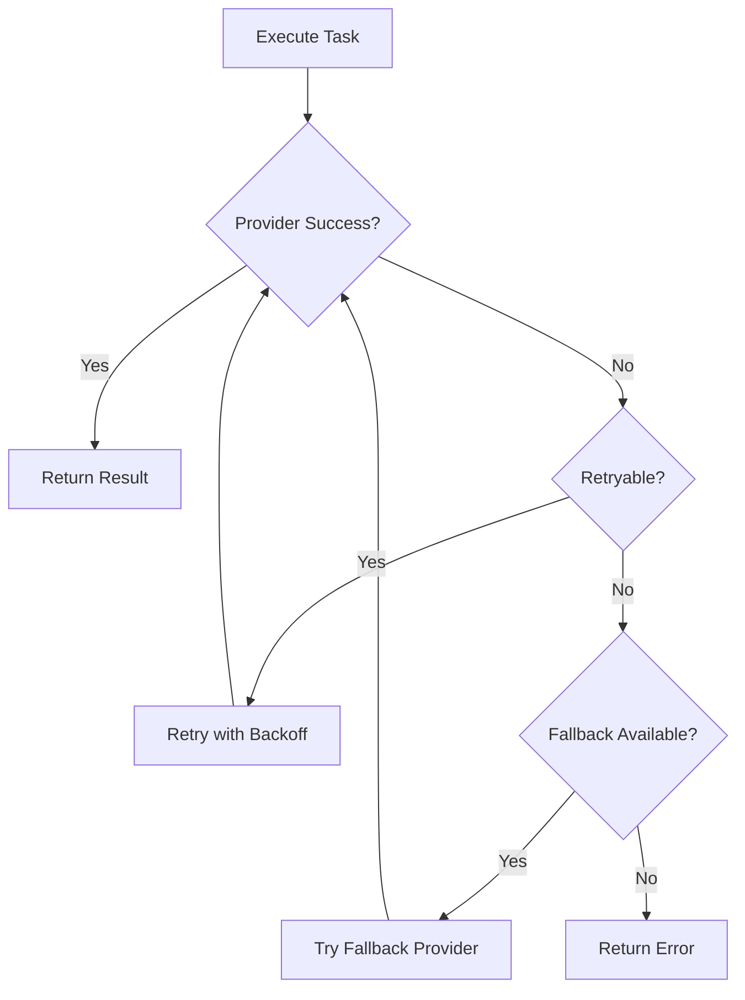
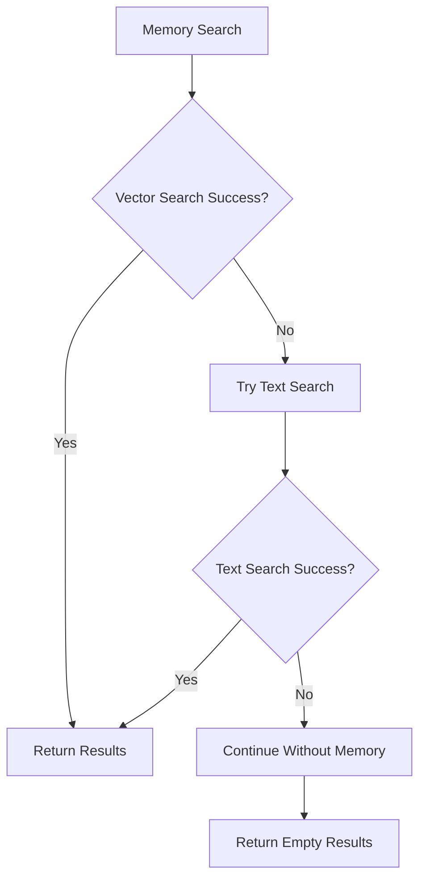
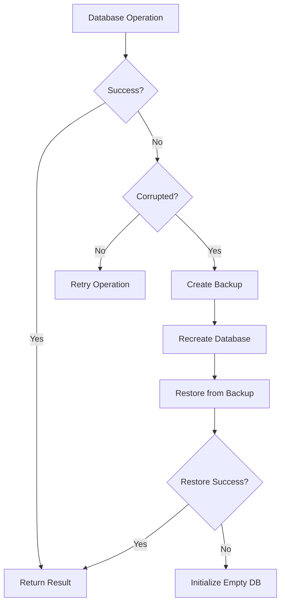

# Error Recovery Specification - AutomatosX v4.0

**Date**: 2025-10-04
**Priority**: 🟠 HIGH
**Implementation**: Sprint 2.3

---

## Executive Summary

This document defines how AutomatosX handles failures, implements retry logic, and recovers gracefully from errors. The goal is to make the system **resilient and self-healing** while providing clear feedback to users.

**Key Principle**: Fail gracefully, retry intelligently, degrade smoothly.

---

## Table of Contents

1. [Retry Policies](#retry-policies)
2. [Fallback Strategies](#fallback-strategies)
3. [Circuit Breaker Pattern](#circuit-breaker-pattern)
4. [Graceful Degradation](#graceful-degradation)
5. [Error Classification](#error-classification)
6. [Recovery Workflows](#recovery-workflows)

---

## Retry Policies

### Retry Configuration

```typescript
interface RetryPolicy {
  maxAttempts: number;          // Default: 3
  backoff: 'exponential' | 'linear' | 'fixed';
  initialDelay: number;         // Default: 1000ms
  maxDelay: number;             // Default: 30000ms (30 seconds)
  retryableErrors: string[];    // ['TIMEOUT', 'RATE_LIMIT', 'NETWORK_ERROR']
}
```

### Default Retry Policy

```typescript
const DEFAULT_RETRY_POLICY: RetryPolicy = {
  maxAttempts: 3,
  backoff: 'exponential',
  initialDelay: 1000,           // 1 second
  maxDelay: 30000,              // 30 seconds
  retryableErrors: [
    'TIMEOUT',
    'RATE_LIMIT',
    'NETWORK_ERROR',
    'ECONNREFUSED',
    'ECONNRESET',
    'ETIMEDOUT'
  ]
};
```

### Backoff Strategies

#### Exponential Backoff
```typescript
// Delay = initialDelay * (2 ^ attempt)
// Attempt 1: 1s
// Attempt 2: 2s
// Attempt 3: 4s
```

#### Linear Backoff
```typescript
// Delay = initialDelay * attempt
// Attempt 1: 1s
// Attempt 2: 2s
// Attempt 3: 3s
```

#### Fixed Backoff
```typescript
// Delay = initialDelay
// Attempt 1: 1s
// Attempt 2: 1s
// Attempt 3: 1s
```

---

### Retry Implementation

```typescript
class RetryManager {
  async executeWithRetry<T>(
    operation: () => Promise<T>,
    policy: RetryPolicy = DEFAULT_RETRY_POLICY
  ): Promise<T> {
    let lastError: Error;

    for (let attempt = 1; attempt <= policy.maxAttempts; attempt++) {
      try {
        return await operation();
      } catch (error) {
        lastError = error as Error;

        // Check if error is retryable
        if (!this.isRetryable(error, policy)) {
          throw error;
        }

        // Don't retry on last attempt
        if (attempt === policy.maxAttempts) {
          throw error;
        }

        // Calculate delay
        const delay = this.calculateDelay(attempt, policy);

        logger.warn(`Retry attempt ${attempt}/${policy.maxAttempts}`, {
          error: error.message,
          delay,
          nextAttempt: attempt + 1
        });

        await this.sleep(delay);
      }
    }

    throw lastError!;
  }

  private calculateDelay(attempt: number, policy: RetryPolicy): number {
    let delay: number;

    switch (policy.backoff) {
      case 'exponential':
        delay = policy.initialDelay * Math.pow(2, attempt - 1);
        break;
      case 'linear':
        delay = policy.initialDelay * attempt;
        break;
      case 'fixed':
        delay = policy.initialDelay;
        break;
    }

    return Math.min(delay, policy.maxDelay);
  }

  private isRetryable(error: unknown, policy: RetryPolicy): boolean {
    if (!(error instanceof Error)) return false;

    return policy.retryableErrors.some(retryableError =>
      error.message.includes(retryableError) ||
      (error as any).code === retryableError
    );
  }

  private sleep(ms: number): Promise<void> {
    return new Promise(resolve => setTimeout(resolve, ms));
  }
}
```

---

## Fallback Strategies

### Provider Fallback

```typescript
// Priority: Primary → Fallback 1 → Fallback 2 → Error

interface ProviderFallback {
  primary: string;        // 'claude'
  fallback: string[];     // ['gemini', 'openai']
  maxAttempts: number;    // 2 (try each fallback once)
}
```

#### Provider Selection Flow

```
1. Try preferred provider (from agent profile)
   ↓ [FAIL]
2. Try next highest priority provider
   ↓ [FAIL]
3. Try remaining providers
   ↓ [ALL FAIL]
4. Return error with suggestions
```

#### Implementation

```typescript
class ProviderRouter {
  async executeWithFallback(
    task: Task,
    primaryProvider: string,
    fallbackProviders: string[]
  ): Promise<Response> {
    const providers = [primaryProvider, ...fallbackProviders];
    const errors: Error[] = [];

    for (const providerName of providers) {
      try {
        logger.info(`Attempting provider: ${providerName}`);
        const provider = this.getProvider(providerName);
        return await provider.execute(task);
      } catch (error) {
        errors.push(error as Error);
        logger.warn(`Provider ${providerName} failed`, { error });

        // Continue to next provider
        continue;
      }
    }

    // All providers failed
    throw new ProviderError(
      `All providers failed (tried: ${providers.join(', ')})`,
      { providers, errors }
    );
  }
}
```

---

### Memory Search Fallback

```
Vector Search → Text Search → No Memory
```

#### Implementation

```typescript
class MemoryManager {
  async searchWithFallback(query: string): Promise<Memory[]> {
    try {
      // Primary: Vector search
      return await this.vectorSearch(query);
    } catch (error) {
      logger.warn('Vector search failed, trying text search', { error });

      try {
        // Fallback: Text search
        return await this.textSearch(query);
      } catch (error2) {
        logger.warn('Text search failed, continuing without memory', { error: error2 });

        // Graceful degradation: No memory
        return [];
      }
    }
  }
}
```

---

### Agent Execution Fallback

```
Normal Execution → Extended Timeout → Partial Results
```

```typescript
class AgentExecutor {
  async executeWithFallback(agent: Agent, task: string): Promise<Response> {
    try {
      // Normal execution (default timeout: 30s)
      return await this.execute(agent, task, { timeout: 30000 });
    } catch (error) {
      if (error.code === 'TIMEOUT') {
        logger.warn('Normal execution timed out, retrying with extended timeout');

        try {
          // Retry with extended timeout (60s)
          return await this.execute(agent, task, { timeout: 60000 });
        } catch (error2) {
          logger.warn('Extended timeout failed, returning partial results');

          // Return partial results if available
          return this.getPartialResults(agent, task);
        }
      }

      throw error;
    }
  }
}
```

---

## Circuit Breaker Pattern

### Purpose
Prevent cascading failures by "opening the circuit" after repeated failures.

### States

```
CLOSED (Normal) → OPEN (Failing) → HALF_OPEN (Testing) → CLOSED
```

#### State Transitions

1. **CLOSED** (Normal operation)
   - All requests pass through
   - Track failure count
   - If failures exceed threshold → OPEN

2. **OPEN** (Circuit tripped)
   - Immediately return error (fast-fail)
   - Don't attempt operation
   - After timeout period → HALF_OPEN

3. **HALF_OPEN** (Testing recovery)
   - Allow one test request
   - If succeeds → CLOSED
   - If fails → OPEN

---

### Implementation

```typescript
class CircuitBreaker {
  private state: 'CLOSED' | 'OPEN' | 'HALF_OPEN' = 'CLOSED';
  private failureCount = 0;
  private lastFailureTime?: Date;

  private readonly config = {
    failureThreshold: 5,      // Open after 5 failures
    timeout: 60000,           // Stay open for 60 seconds
    resetTimeout: 30000       // Reset counter after 30 seconds
  };

  async execute<T>(operation: () => Promise<T>): Promise<T> {
    // Check circuit state
    if (this.state === 'OPEN') {
      if (this.shouldAttemptReset()) {
        this.state = 'HALF_OPEN';
        logger.info('Circuit breaker: HALF_OPEN (testing recovery)');
      } else {
        throw new CircuitBreakerError('Circuit is OPEN (fast-fail)');
      }
    }

    try {
      // Execute operation
      const result = await operation();

      // Success - reset circuit
      this.onSuccess();
      return result;

    } catch (error) {
      // Failure - update circuit
      this.onFailure();
      throw error;
    }
  }

  private onSuccess(): void {
    this.failureCount = 0;
    this.lastFailureTime = undefined;

    if (this.state === 'HALF_OPEN') {
      this.state = 'CLOSED';
      logger.info('Circuit breaker: CLOSED (recovered)');
    }
  }

  private onFailure(): void {
    this.failureCount++;
    this.lastFailureTime = new Date();

    if (this.failureCount >= this.config.failureThreshold) {
      this.state = 'OPEN';
      logger.error('Circuit breaker: OPEN (threshold exceeded)', {
        failures: this.failureCount,
        threshold: this.config.failureThreshold
      });
    }
  }

  private shouldAttemptReset(): boolean {
    if (!this.lastFailureTime) return false;

    const elapsed = Date.now() - this.lastFailureTime.getTime();
    return elapsed >= this.config.timeout;
  }
}
```

---

### Circuit Breaker Usage

```typescript
// Wrap provider calls with circuit breaker
const breaker = new CircuitBreaker();

async function callProvider(task: string): Promise<Response> {
  return breaker.execute(async () => {
    return await provider.execute(task);
  });
}
```

**Behavior**:
- After 5 failures: Stop trying for 60 seconds (fast-fail)
- After 60 seconds: Try one request (test recovery)
- If succeeds: Resume normal operation
- If fails: Stay open for another 60 seconds

---

## Graceful Degradation

### Principle
Reduce functionality gracefully instead of failing completely.

### Degradation Levels

```
Full Feature → Reduced Feature → Minimal Feature → Error
```

---

### Memory System Degradation

```
Vector Search → Text Search → No Memory
```

**Impact**:
- Full: Context-aware responses (best quality)
- Reduced: Text-based context (good quality)
- Minimal: No context (basic quality)

---

### Provider Degradation

```
Claude → Gemini → OpenAI → Error
```

**Impact**:
- Full: Preferred provider (optimal performance)
- Reduced: Fallback provider (good performance)
- Minimal: Last resort provider (acceptable performance)
- Error: No providers available (user notified)

---

### Agent Profile Degradation

```
Full Profile → Minimal Profile → System Default
```

```typescript
interface ProfileDegradation {
  full: AgentProfile;          // User-defined profile
  minimal: Partial<AgentProfile>; // Essential fields only
  default: AgentProfile;       // System defaults
}
```

**Example**:
```typescript
// Full profile (preferred)
{
  name: 'coder',
  abilities: ['code-generation', 'refactoring'],
  provider: { primary: 'claude', fallback: ['gemini'] },
  settings: { temperature: 0.3, max_tokens: 8000 }
}

// Minimal profile (degraded)
{
  name: 'coder',
  provider: { primary: 'claude' },
  settings: { temperature: 0.7 }
}

// System default (fallback)
{
  name: 'default',
  provider: { primary: 'claude' },
  settings: { temperature: 0.7, max_tokens: 4000 }
}
```

---

## Error Classification

### Error Severity Levels

| Level | Description | Action |
|-------|-------------|--------|
| 🔴 CRITICAL | System failure | Immediate exit, notify user |
| 🟠 HIGH | Operation failed | Retry, fallback, or fail |
| 🟡 MEDIUM | Degraded performance | Log warning, continue |
| 🟢 LOW | Minor issue | Log info, ignore |

---

### Error Categories

#### 1. Retriable Errors (🟡 MEDIUM)
- Network timeouts
- Rate limits
- Temporary provider unavailability

**Action**: Retry with backoff

---

#### 2. Fallback Errors (🟠 HIGH)
- Provider failure
- Vector search failure
- Profile load error

**Action**: Try fallback strategy

---

#### 3. Fatal Errors (🔴 CRITICAL)
- Configuration corruption
- Database corruption
- Permission denied (security)

**Action**: Fail immediately, notify user

---

#### 4. User Errors (🟢 LOW)
- Invalid input
- Agent not found
- Missing required field

**Action**: Show helpful error message

---

### Error Response Template

```typescript
interface ErrorResponse {
  severity: 'CRITICAL' | 'HIGH' | 'MEDIUM' | 'LOW';
  message: string;
  cause: string;
  suggestions: string[];
  context?: Record<string, unknown>;
}
```

**Example**:
```typescript
{
  severity: 'HIGH',
  message: 'Provider "claude" unavailable',
  cause: 'Authentication failed',
  suggestions: [
    'Run: claude auth login',
    'Set: export ANTHROPIC_API_KEY=your-key',
    'Try: automatosx run <agent> "<task>" --provider gemini'
  ],
  context: {
    provider: 'claude',
    agent: 'coder',
    fallbackAvailable: true
  }
}
```

---

## Recovery Workflows

### Provider Failure Recovery



---

### Memory Search Recovery



---

### Database Recovery



---

## Implementation Plan

### Sprint 2.3: Error Recovery (Week 10-11)

**Week 10**:
- [ ] Implement retry manager with backoff strategies
- [ ] Add circuit breaker pattern
- [ ] Create provider fallback logic

**Week 11**:
- [ ] Implement memory search fallback
- [ ] Add agent execution degradation
- [ ] Create error classification system
- [ ] Write recovery workflow tests

**Deliverables**:
- ✅ Retry manager (exponential, linear, fixed backoff)
- ✅ Circuit breaker (prevent cascading failures)
- ✅ Fallback strategies (provider, memory, agent)
- ✅ Graceful degradation (reduce features, not fail)
- ✅ Error recovery workflows (automated recovery)

---

## Testing Strategy

### Unit Tests
```typescript
describe('RetryManager', () => {
  it('should retry on retryable errors', async () => {
    // Test exponential backoff
    // Test max attempts limit
    // Test retryable error detection
  });
});

describe('CircuitBreaker', () => {
  it('should open circuit after threshold', async () => {
    // Test state transitions
    // Test timeout behavior
    // Test recovery testing
  });
});
```

### Integration Tests
```typescript
describe('Provider Fallback', () => {
  it('should fallback to next provider on failure', async () => {
    // Mock primary provider failure
    // Verify fallback provider called
    // Check result correctness
  });
});
```

---

## Monitoring and Observability

### Metrics to Track

1. **Retry Rate**
   - Retries per operation
   - Success rate after retry
   - Average retry delay

2. **Circuit Breaker Events**
   - Circuit open count
   - Time in open state
   - Recovery success rate

3. **Fallback Usage**
   - Fallback invocation count
   - Fallback success rate
   - Primary vs fallback usage ratio

4. **Error Distribution**
   - Errors by category
   - Errors by severity
   - Top error messages

---

## Success Criteria

| Metric | Target | Measurement |
|--------|--------|-------------|
| Retry success rate | 80%+ | Successful after retry / Total retries |
| Fallback effectiveness | 90%+ | Successful fallbacks / Total fallbacks |
| Circuit breaker recovery | <2 min | Time from OPEN to CLOSED |
| Error recovery rate | 70%+ | Recovered errors / Total errors |

---

## Conclusion

Robust error recovery is essential for production-ready AutomatosX. By implementing retry policies, fallback strategies, circuit breakers, and graceful degradation, we ensure the system remains resilient and user-friendly even when failures occur.

**Status**: 📋 Planned for Sprint 2.3
**Implementation Date**: Week 10-11 (Month 3)

---

**Document Date**: 2025-10-04
**Next Review**: Sprint 2.3 kickoff
**Related**: PRD/03-technical-specification.md, PRD/17-user-experience-specification.md
