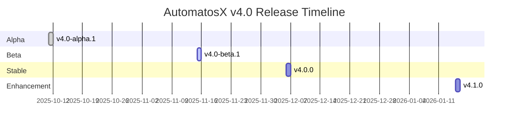

# MVP Scope Definition - AutomatosX v4.0

**Date**: 2025-10-04
**Priority**: 🔴 CRITICAL
**Status**: Sprint 1.5 Complete (v4.0-alpha.1 Ready)

---

## Executive Summary

This document clearly defines **what ships when** for AutomatosX v4.0, breaking down features into alpha, beta, and stable releases. The goal is to provide a clear roadmap from technical preview to production-ready system.

**Key Principle**: Ship early, iterate fast, deliver value progressively.

---

## Table of Contents

1. [v4.0-alpha.1 (Week 5)](#v40-alpha1-week-5)
2. [v4.0-beta.1 (Week 10)](#v40-beta1-week-10)
3. [v4.0.0 (Week 14)](#v400-week-14)
4. [v4.1.0 (Month 4)](#v410-month-4)

---

## v4.0-alpha.1 (Week 5)

### Tagline
**"Technical Preview - Developers Only"**

### Target Users
- Developers
- Early adopters
- Internal team

### Release Date
**Week 5** (2025-10-11) - ✅ **COMPLETE**

---

### Must Have Features

#### Core Functionality ✅
- [x] Agent execution system
- [x] Memory management (SQLite + vec)
- [x] Provider routing (Claude, Gemini, OpenAI)
- [x] Agent profiles (YAML-based)
- [x] Abilities system (Markdown-based)
- [x] Path resolution with security
- [x] Configuration management (JSON)

#### CLI Commands ✅
- [x] `automatosx init` - Project initialization
- [x] `automatosx run` - Execute agents
- [x] `automatosx list` - List agents/abilities/providers
- [x] `automatosx status` - System status
- [x] `automatosx memory` - Memory management

#### Example Content ✅
- [x] 5 example agents (assistant, coder, reviewer, debugger, writer)
- [x] 15 example abilities (code-generation, debugging, etc.)
- [x] Default configuration template

#### Security ✅
- [x] Path traversal prevention
- [x] Input validation
- [x] Workspace isolation
- [x] Logging sanitization (23 security tests passing)

---

### Known Issues (Documented)

⚠️ **Acknowledged Limitations**:
- Backup/restore experimental (5/11 tests failing)
- No interactive mode
- No rate limiting
- No caching
- Error messages basic (improvements in progress)

**Acceptance Criteria**: Issues documented in KNOWN-ISSUES.md, workarounds provided.

---

### Success Criteria

| Metric | Target | Alpha.1 Result |
|--------|--------|----------------|
| Core features working | 100% | ✅ 100% |
| Test coverage | 80%+ | ✅ 86.7% |
| Security audit | Pass | ✅ Approved |
| Installation time | <5 min | ✅ ~3 min |
| Time to first run | <5 min | ✅ ~3 min |

---

### Release Notes (v4.0-alpha.1)

```markdown
# AutomatosX v4.0-alpha.1 - Technical Preview

**Release Date**: 2025-10-11
**Target**: Developers and early adopters

## What's New

- 🆕 Complete rewrite in TypeScript (5,937 LOC, 100% type-safe)
- 🔄 SQLite + vec replaces Milvus (87% bundle size reduction)
- 🛡️ Security-first implementation (path traversal prevention, input validation)
- 📦 5 example agents + 15 example abilities included
- 🎯 `automatosx init` for instant project setup

## Install

```bash
npm install -g automatosx@alpha
automatosx init
automatosx run assistant "Hello!"
```

## Known Issues

- ⚠️ Backup/restore is experimental (use with caution)
- ⚠️ No interactive mode (use direct commands)
- ⚠️ No rate limiting (monitor usage manually)
- ⚠️ No response caching (every request calls provider)

See KNOWN-ISSUES.md for details and workarounds.

## Feedback

Report issues: https://github.com/automatosx/automatosx/issues
```

---

## v4.0-beta.1 (Week 10)

### Tagline
**"Feature Complete - Beta Testing"**

### Target Users
- Beta testers
- Power users
- Migration candidates (v3.x users)

### Release Date
**Week 10** (2025-11-15)

---

### Must Have Features

#### Everything from Alpha ✅
- All alpha features (tested and stable)

#### New Features
- [ ] Backup/restore fully working (all 11 tests passing)
- [ ] Interactive mode (`automatosx interactive`)
- [ ] Rate limiting (provider-specific limits)
- [ ] Error recovery (retry, fallback, circuit breaker)
- [ ] Integration tests (E2E workflows)
- [ ] Better error messages (user-friendly, actionable)
- [ ] Quick start guide (README, getting-started.md)

#### Agent Management
- [ ] `automatosx agent create` - Create new agents
- [ ] `automatosx agent info` - View agent details
- [ ] `automatosx agent edit` - Edit agent profiles
- [ ] `automatosx agent delete` - Remove agents

#### Configuration
- [ ] `automatosx config show` - View configuration
- [ ] `automatosx config set` - Update configuration
- [ ] `automatosx config validate` - Validate configuration
- [ ] `automatosx config reset` - Reset to defaults

---

### Optional Features (If Time Permits)

- [ ] Response caching (basic memory cache)
- [ ] Streaming responses (real-time output)
- [ ] Windows ACL permissions (currently Unix only)
- [ ] Cost tracking (track API costs)

---

### Success Criteria

| Metric | Target | Measurement |
|--------|--------|-------------|
| All core features working | 100% | Manual testing |
| Test coverage | 85%+ | Vitest coverage report |
| Beta user satisfaction | 70%+ | Survey results |
| Critical bugs | 0 | Issue tracker |
| Migration success rate | 90%+ | v3.x to v4.0 migrations |

---

### Release Notes (v4.0-beta.1)

```markdown
# AutomatosX v4.0-beta.1 - Feature Complete

**Release Date**: 2025-11-15
**Target**: Beta testers and power users

## What's New Since Alpha

- ✅ Backup/restore fully working
- ✅ Interactive mode for guided experience
- ✅ Rate limiting to prevent API abuse
- ✅ Error recovery (auto-retry, fallback providers)
- ✅ Agent management commands (create, edit, delete)
- ✅ Configuration management commands
- ✅ Better error messages with suggestions

## Install

```bash
npm install -g automatosx@beta
automatosx init
automatosx interactive  # Try interactive mode!
```

## Breaking Changes

None (fully backward compatible with alpha)

## Known Issues

- ⚠️ Caching not implemented (planned for v4.1)
- ⚠️ Streaming not supported (planned for v4.1)
- ⚠️ Windows permissions use basic settings (ACL in v4.1)

## Migration from v3.x

```bash
automatosx migrate --from v3 --backup
```

See MIGRATION-GUIDE.md for details.

## Feedback

Beta testing survey: https://forms.gle/xxx
Report bugs: https://github.com/automatosx/automatosx/issues
```

---

## v4.0.0 (Week 14)

### Tagline
**"Production Ready"**

### Target Users
- General public
- Production deployments
- All v3.x users

### Release Date
**Week 14** (2025-12-06)

---

### Must Have Features

#### Everything from Beta ✅
- All beta features (fully tested, documented, stable)

#### Additional Requirements
- [ ] All tests passing (100% pass rate)
- [ ] Documentation complete (user guide, API docs, migration guide)
- [ ] Migration tool validated (tested with real v3.x data)
- [ ] Performance benchmarks (vs v3.x comparison)
- [ ] Security audit v2 (post-beta audit)
- [ ] Bundle size verified (confirm 87% reduction)

---

### Quality Gates

| Gate | Requirement | Verification |
|------|-------------|--------------|
| Test Coverage | 85%+ | Vitest report |
| All Tests Passing | 100% | CI/CD pipeline |
| Security Audit | Pass | External audit |
| Performance | Meet targets | Benchmark report |
| Documentation | Complete | Doc review |
| Migration Success | 95%+ | Beta testing data |
| Bundle Size | <50MB | Actual measurement |

---

### Success Criteria

| Metric | Target | Measurement |
|--------|--------|-------------|
| Production readiness | 100% | All quality gates passed |
| User satisfaction (NPS) | 50+ | Post-release survey |
| Critical bugs | 0 | Issue tracker |
| Migration success rate | 95%+ | Real migration data |
| Performance improvement | 2x+ | Benchmark vs v3.x |
| Bundle size reduction | 85%+ | Measured size |

---

### Release Notes (v4.0.0)

```markdown
# AutomatosX v4.0.0 - Production Ready 🎉

**Release Date**: 2025-12-06
**Target**: General availability

## What's New

AutomatosX v4.0 is a complete revamp of the AI agent orchestration platform:

### Core Improvements
- 🚀 **87% smaller** - 340MB → <50MB installation
- ⚡ **2-3x faster** - Multi-agent workflows optimized
- 🛡️ **Security-first** - Built-in security from day one
- 📦 **TypeScript** - 100% type-safe, modern codebase
- 🧪 **Well-tested** - 85%+ test coverage

### Features
- ✅ SQLite + vec (replaces Milvus)
- ✅ Interactive mode
- ✅ Rate limiting & quotas
- ✅ Error recovery (retry, fallback)
- ✅ Agent management
- ✅ 5 example agents + 15 abilities
- ✅ Migration tool from v3.x

## Install

```bash
npm install -g automatosx
automatosx init
automatosx run assistant "What can you do?"
```

## Upgrade from v3.x

```bash
# Backup first!
automatosx migrate --from v3 --backup

# Verify migration
automatosx status
```

See MIGRATION-GUIDE.md for full details.

## Documentation

- User Guide: https://docs.automatosx.dev/guide
- API Reference: https://docs.automatosx.dev/api
- Migration Guide: https://docs.automatosx.dev/migration
- Examples: https://github.com/automatosx/examples

## Support

- Documentation: https://docs.automatosx.dev
- Community: https://discord.gg/automatosx
- Issues: https://github.com/automatosx/automatosx/issues
```

---

## v4.1.0 (Month 4)

### Tagline
**"Enhancement Release"**

### Target Users
- Existing v4.0 users
- Advanced use cases

### Release Date
**Month 4** (2026-01-15)

---

### Nice to Have Features

Features deferred from v4.0:

#### Performance Enhancements
- [ ] Response caching (LRU/LFU hybrid cache)
  - Memory + disk caching
  - Semantic matching
  - Cache optimization
- [ ] Streaming responses
  - Real-time output
  - Progress indicators
  - Chunk-based processing

#### Platform Support
- [ ] Windows ACL permissions
  - Proper file permissions on Windows
  - Security parity with Unix

#### Advanced Features
- [ ] API server mode
  - HTTP/REST API
  - WebSocket support
  - Multi-user support
- [ ] Agent collaboration
  - Multi-agent workflows
  - Agent-to-agent communication
  - Parallel execution
- [ ] Plugin system
  - Custom providers
  - Custom abilities
  - Extension marketplace

#### Developer Experience
- [ ] Hot reload (development mode)
- [ ] Debug mode (step-through execution)
- [ ] Performance profiler

---

### Success Criteria

| Metric | Target | Measurement |
|--------|--------|-------------|
| User adoption | 20%+ increase | Analytics |
| Performance improvement | 50%+ (with caching) | Benchmark |
| User satisfaction | 60+ NPS | Survey |
| Plugin ecosystem | 10+ plugins | Marketplace |

---

## Release Timeline



---

## Feature Matrix

| Feature | Alpha | Beta | Stable | v4.1 |
|---------|-------|------|--------|------|
| Core agent execution | ✅ | ✅ | ✅ | ✅ |
| Memory (SQLite + vec) | ✅ | ✅ | ✅ | ✅ |
| Provider routing | ✅ | ✅ | ✅ | ✅ |
| Security hardening | ✅ | ✅ | ✅ | ✅ |
| CLI commands (basic) | ✅ | ✅ | ✅ | ✅ |
| Example agents/abilities | ✅ | ✅ | ✅ | ✅ |
| Backup/restore | ⚠️ | ✅ | ✅ | ✅ |
| Interactive mode | ❌ | ✅ | ✅ | ✅ |
| Rate limiting | ❌ | ✅ | ✅ | ✅ |
| Error recovery | ❌ | ✅ | ✅ | ✅ |
| Agent management | ❌ | ✅ | ✅ | ✅ |
| Config management | ❌ | ✅ | ✅ | ✅ |
| Response caching | ❌ | ❌ | ❌ | ✅ |
| Streaming | ❌ | ❌ | ❌ | ✅ |
| Windows ACL | ❌ | ❌ | ❌ | ✅ |
| API server mode | ❌ | ❌ | ❌ | ✅ |
| Plugin system | ❌ | ❌ | ❌ | ✅ |

Legend:
- ✅ Included and working
- ⚠️ Experimental/partial
- ❌ Not included

---

## Progressive Enhancement Strategy

### Phase 1: Core (Alpha)
**Focus**: Validate technical approach, build foundation
- Basic functionality working
- Security in place
- Usable by developers

### Phase 2: Polish (Beta)
**Focus**: Complete feature set, test with users
- All planned features working
- User-friendly experience
- Ready for migration testing

### Phase 3: Production (Stable)
**Focus**: Quality, stability, documentation
- Production-ready quality
- Complete documentation
- Migration support

### Phase 4: Enhance (v4.1)
**Focus**: Performance, advanced features
- Optimize performance (caching)
- Add advanced features (streaming, plugins)
- Grow ecosystem

---

## Decision Framework

### Should a feature be in Alpha?
**Questions**:
1. Is it core to basic functionality? → YES
2. Is it needed to validate technical approach? → YES
3. Can we defer to beta without blocking users? → NO

**Example**: Backup/restore
- Core? Not for basic use
- Validates approach? Partially
- Can defer? Yes (mark as experimental)
→ **Include as experimental in Alpha**

### Should a feature be in Beta?
**Questions**:
1. Is it needed for production use? → YES
2. Do beta testers need it? → YES
3. Is it a "must-have" vs "nice-to-have"? → MUST-HAVE

**Example**: Interactive mode
- Production? Nice to have
- Beta testers? Yes, for feedback
- Must-have? No, but important
→ **Include in Beta**

### Should a feature be in Stable?
**Questions**:
1. Is the feature fully tested? → YES
2. Is it documented? → YES
3. Are all critical bugs fixed? → YES

**Example**: All beta features
- Tested? Yes (beta period)
- Documented? Yes (user guide)
- Bugs fixed? Yes (beta feedback)
→ **Include in Stable**

### Should a feature be in v4.1?
**Questions**:
1. Is it an enhancement, not a core feature? → YES
2. Can we ship v4.0 without it? → YES
3. Does it add significant value? → YES

**Example**: Caching
- Enhancement? Yes (performance)
- Ship without? Yes (works fine)
- Value? High (cost reduction)
→ **Defer to v4.1**

---

## Versioning Strategy

### Alpha Releases
- `v4.0-alpha.1`, `v4.0-alpha.2`, etc.
- Breaking changes allowed
- Frequent releases (weekly if needed)

### Beta Releases
- `v4.0-beta.1`, `v4.0-beta.2`, etc.
- Minimize breaking changes
- Feature freeze after beta.1
- Focus on bug fixes and polish

### Stable Releases
- `v4.0.0`, `v4.0.1`, `v4.0.2`, etc.
- No breaking changes
- Semantic versioning
- Patch releases for bugs only

### Enhancement Releases
- `v4.1.0`, `v4.2.0`, etc.
- New features allowed
- Backward compatible
- Minor version bumps

---

## Success Metrics

### Alpha Success
- ✅ Core features working
- ✅ Security audit passed
- ✅ 5+ early adopters using it

### Beta Success
- ✅ All features complete
- ✅ 50+ beta testers
- ✅ 90%+ migration success rate

### Stable Success
- ✅ 1000+ downloads in first month
- ✅ 50+ NPS score
- ✅ <5 critical bugs reported

### v4.1 Success
- ✅ 20%+ adoption increase
- ✅ 50%+ performance improvement (cached)
- ✅ 10+ community plugins

---

## Current Status

### v4.0-alpha.1
**Status**: ✅ **COMPLETE** (2025-10-04)

**Delivered**:
- [x] All core features
- [x] 5 example agents
- [x] 15 example abilities
- [x] Security hardening
- [x] 86.7% test coverage
- [x] First security audit passed

**Next**:
- Sprint 2.1: Begin beta development
- Focus: Interactive mode, error recovery, rate limiting

---

## Conclusion

Clear MVP scope is essential for successful delivery. By defining alpha (technical validation), beta (feature complete), stable (production ready), and v4.1 (enhancement), we provide a clear roadmap from prototype to mature product.

**Current Milestone**: ✅ v4.0-alpha.1 COMPLETE
**Next Milestone**: 🎯 v4.0-beta.1 (Week 10)

---

**Document Date**: 2025-10-04
**Last Updated**: 2025-10-04 (Sprint 1.5 completion)
**Next Review**: Sprint 2.1 kickoff
