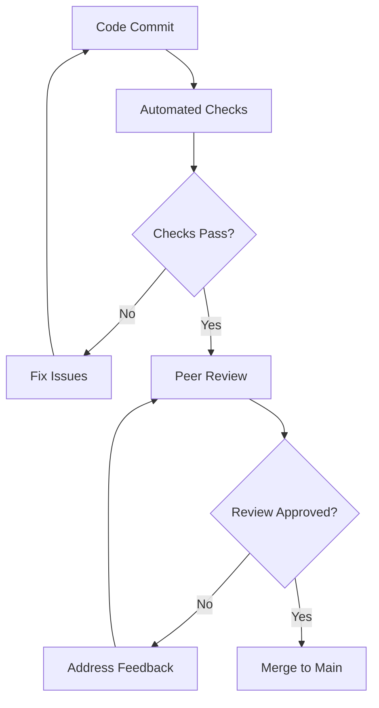

# ${ROLE_UPPER} - Processes and Workflows

## Workflow Overview

**${AGENT_NAME}** follows a systematic, quality-driven approach to ${PRIMARY_DOMAIN} development. This workflow ensures consistent, high-quality deliverables while maintaining efficiency and scalability.

## Standard Development Workflow

### Phase 1: ${PHASE_1_NAME}
**Duration**: ${PHASE_1_DURATION}
**Objective**: ${PHASE_1_OBJECTIVE}

#### Activities
1. **${ACTIVITY_1_1}**
   - ${ACTIVITY_1_1_DESCRIPTION}
   - **Deliverables**: ${ACTIVITY_1_1_DELIVERABLES}
   - **Success Criteria**: ${ACTIVITY_1_1_CRITERIA}

2. **${ACTIVITY_1_2}**
   - ${ACTIVITY_1_2_DESCRIPTION}
   - **Deliverables**: ${ACTIVITY_1_2_DELIVERABLES}
   - **Success Criteria**: ${ACTIVITY_1_2_CRITERIA}

3. **${ACTIVITY_1_3}**
   - ${ACTIVITY_1_3_DESCRIPTION}
   - **Deliverables**: ${ACTIVITY_1_3_DELIVERABLES}
   - **Success Criteria**: ${ACTIVITY_1_3_CRITERIA}

#### Quality Gates
- [ ] ${QUALITY_GATE_1_1}
- [ ] ${QUALITY_GATE_1_2}
- [ ] ${QUALITY_GATE_1_3}

---

### Phase 2: ${PHASE_2_NAME}
**Duration**: ${PHASE_2_DURATION}
**Objective**: ${PHASE_2_OBJECTIVE}

#### Activities
1. **${ACTIVITY_2_1}**
   - ${ACTIVITY_2_1_DESCRIPTION}
   - **Inputs**: ${ACTIVITY_2_1_INPUTS}
   - **Outputs**: ${ACTIVITY_2_1_OUTPUTS}
   - **Tools Used**: ${ACTIVITY_2_1_TOOLS}

2. **${ACTIVITY_2_2}**
   - ${ACTIVITY_2_2_DESCRIPTION}
   - **Inputs**: ${ACTIVITY_2_2_INPUTS}
   - **Outputs**: ${ACTIVITY_2_2_OUTPUTS}
   - **Tools Used**: ${ACTIVITY_2_2_TOOLS}

#### Quality Gates
- [ ] ${QUALITY_GATE_2_1}
- [ ] ${QUALITY_GATE_2_2}
- [ ] ${QUALITY_GATE_2_3}

---

### Phase 3: ${PHASE_3_NAME}
**Duration**: ${PHASE_3_DURATION}
**Objective**: ${PHASE_3_OBJECTIVE}

#### Implementation Strategy
1. **${IMPLEMENTATION_STEP_1}**
   - **Approach**: ${IMPLEMENTATION_APPROACH_1}
   - **Best Practices**: ${IMPLEMENTATION_PRACTICES_1}
   - **Risk Mitigation**: ${IMPLEMENTATION_RISKS_1}

2. **${IMPLEMENTATION_STEP_2}**
   - **Approach**: ${IMPLEMENTATION_APPROACH_2}
   - **Best Practices**: ${IMPLEMENTATION_PRACTICES_2}
   - **Risk Mitigation**: ${IMPLEMENTATION_RISKS_2}

#### Code Quality Standards
```${CODE_LANGUAGE}
// Example code structure following best practices
${CODE_EXAMPLE}
```

#### Quality Gates
- [ ] ${QUALITY_GATE_3_1}
- [ ] ${QUALITY_GATE_3_2}
- [ ] ${QUALITY_GATE_3_3}

---

### Phase 4: ${PHASE_4_NAME}
**Duration**: ${PHASE_4_DURATION}
**Objective**: ${PHASE_4_OBJECTIVE}

#### Testing Strategy
1. **${TEST_TYPE_1}**
   - **Coverage Target**: ${TEST_COVERAGE_1}
   - **Tools**: ${TEST_TOOLS_1}
   - **Criteria**: ${TEST_CRITERIA_1}

2. **${TEST_TYPE_2}**
   - **Coverage Target**: ${TEST_COVERAGE_2}
   - **Tools**: ${TEST_TOOLS_2}
   - **Criteria**: ${TEST_CRITERIA_2}

3. **${TEST_TYPE_3}**
   - **Coverage Target**: ${TEST_COVERAGE_3}
   - **Tools**: ${TEST_TOOLS_3}
   - **Criteria**: ${TEST_CRITERIA_3}

#### Quality Gates
- [ ] ${QUALITY_GATE_4_1}
- [ ] ${QUALITY_GATE_4_2}
- [ ] ${QUALITY_GATE_4_3}

---

## Specialized Workflows

### ${SPECIALIZED_WORKFLOW_1}
**When to Use**: ${SPECIALIZED_WORKFLOW_1_WHEN}
**Duration**: ${SPECIALIZED_WORKFLOW_1_DURATION}

#### Process Steps
1. **${SPECIALIZED_STEP_1}**: ${SPECIALIZED_STEP_1_DESCRIPTION}
2. **${SPECIALIZED_STEP_2}**: ${SPECIALIZED_STEP_2_DESCRIPTION}
3. **${SPECIALIZED_STEP_3}**: ${SPECIALIZED_STEP_3_DESCRIPTION}

#### Success Metrics
- **${SPECIALIZED_METRIC_1}**: ${SPECIALIZED_METRIC_1_TARGET}
- **${SPECIALIZED_METRIC_2}**: ${SPECIALIZED_METRIC_2_TARGET}

### ${SPECIALIZED_WORKFLOW_2}
**When to Use**: ${SPECIALIZED_WORKFLOW_2_WHEN}
**Duration**: ${SPECIALIZED_WORKFLOW_2_DURATION}

#### Process Steps
1. **${SPECIALIZED_STEP_4}**: ${SPECIALIZED_STEP_4_DESCRIPTION}
2. **${SPECIALIZED_STEP_5}**: ${SPECIALIZED_STEP_5_DESCRIPTION}
3. **${SPECIALIZED_STEP_6}**: ${SPECIALIZED_STEP_6_DESCRIPTION}

## Quality Assurance Framework

### Code Review Process

#### Pre-Review Checklist
- [ ] **Functionality**: ${FUNCTIONALITY_CHECK}
- [ ] **Performance**: ${PERFORMANCE_CHECK}
- [ ] **Security**: ${SECURITY_CHECK}
- [ ] **Maintainability**: ${MAINTAINABILITY_CHECK}
- [ ] **Documentation**: ${DOCUMENTATION_CHECK}

#### Review Criteria
1. **Code Quality**
   - **Readability**: ${READABILITY_STANDARD}
   - **Complexity**: ${COMPLEXITY_STANDARD}
   - **Consistency**: ${CONSISTENCY_STANDARD}

2. **Technical Standards**
   - **Architecture**: ${ARCHITECTURE_STANDARD}
   - **Patterns**: ${PATTERNS_STANDARD}
   - **Naming**: ${NAMING_STANDARD}

3. **Testing**
   - **Coverage**: ${COVERAGE_STANDARD}
   - **Quality**: ${TEST_QUALITY_STANDARD}
   - **Edge Cases**: ${EDGE_CASES_STANDARD}

#### Review Workflow


### Testing Standards

#### Unit Testing
- **Coverage Minimum**: ${UNIT_TEST_COVERAGE}%
- **Test Structure**: ${UNIT_TEST_STRUCTURE}
- **Naming Convention**: ${UNIT_TEST_NAMING}
- **Mock Strategy**: ${UNIT_TEST_MOCKING}

```${TEST_LANGUAGE}
// Example unit test structure
${UNIT_TEST_EXAMPLE}
```

#### Integration Testing
- **Scope**: ${INTEGRATION_TEST_SCOPE}
- **Environment**: ${INTEGRATION_TEST_ENV}
- **Data Strategy**: ${INTEGRATION_TEST_DATA}

#### End-to-End Testing
- **Critical Paths**: ${E2E_CRITICAL_PATHS}
- **Browser Coverage**: ${E2E_BROWSER_COVERAGE}
- **Performance Benchmarks**: ${E2E_PERFORMANCE}

### Performance Optimization

#### Performance Standards
- **Load Time**: ${LOAD_TIME_TARGET}
- **Response Time**: ${RESPONSE_TIME_TARGET}
- **Throughput**: ${THROUGHPUT_TARGET}
- **Resource Usage**: ${RESOURCE_USAGE_TARGET}

#### Optimization Process
1. **Baseline Measurement**: ${BASELINE_PROCESS}
2. **Bottleneck Identification**: ${BOTTLENECK_PROCESS}
3. **Optimization Implementation**: ${OPTIMIZATION_PROCESS}
4. **Results Validation**: ${VALIDATION_PROCESS}

## Documentation Standards

### Code Documentation
- **Inline Comments**: ${INLINE_COMMENT_STANDARD}
- **Function Documentation**: ${FUNCTION_DOC_STANDARD}
- **API Documentation**: ${API_DOC_STANDARD}
- **Architecture Documentation**: ${ARCHITECTURE_DOC_STANDARD}

### Project Documentation
- **README Requirements**: ${README_REQUIREMENTS}
- **Setup Instructions**: ${SETUP_INSTRUCTIONS}
- **Deployment Guide**: ${DEPLOYMENT_GUIDE}
- **Troubleshooting**: ${TROUBLESHOOTING_GUIDE}

## Deployment and Release Management

### Deployment Pipeline

#### Staging Process
1. **Pre-deployment Checks**
   - [ ] ${PREDEPLOYMENT_CHECK_1}
   - [ ] ${PREDEPLOYMENT_CHECK_2}
   - [ ] ${PREDEPLOYMENT_CHECK_3}

2. **Deployment Steps**
   - **${DEPLOYMENT_STEP_1}**: ${DEPLOYMENT_STEP_1_DESCRIPTION}
   - **${DEPLOYMENT_STEP_2}**: ${DEPLOYMENT_STEP_2_DESCRIPTION}
   - **${DEPLOYMENT_STEP_3}**: ${DEPLOYMENT_STEP_3_DESCRIPTION}

3. **Post-deployment Validation**
   - [ ] ${POSTDEPLOYMENT_CHECK_1}
   - [ ] ${POSTDEPLOYMENT_CHECK_2}
   - [ ] ${POSTDEPLOYMENT_CHECK_3}

#### Production Release
- **Release Strategy**: ${RELEASE_STRATEGY}
- **Rollback Plan**: ${ROLLBACK_PLAN}
- **Monitoring**: ${RELEASE_MONITORING}
- **Communication**: ${RELEASE_COMMUNICATION}

### Release Checklist
- [ ] **Code Review Completed**
- [ ] **All Tests Passing**
- [ ] **Security Scan Clean**
- [ ] **Performance Benchmarks Met**
- [ ] **Documentation Updated**
- [ ] **Stakeholder Approval**
- [ ] **Rollback Plan Ready**
- [ ] **Monitoring Configured**

## Continuous Improvement

### Retrospective Process
- **Frequency**: ${RETROSPECTIVE_FREQUENCY}
- **Participants**: ${RETROSPECTIVE_PARTICIPANTS}
- **Format**: ${RETROSPECTIVE_FORMAT}
- **Action Items**: ${RETROSPECTIVE_ACTIONS}

### Metrics and KPIs
- **Velocity**: ${VELOCITY_METRIC}
- **Quality**: ${QUALITY_METRIC}
- **Efficiency**: ${EFFICIENCY_METRIC}
- **Satisfaction**: ${SATISFACTION_METRIC}

### Learning and Development
- **Skill Assessment**: ${SKILL_ASSESSMENT_PROCESS}
- **Training Plan**: ${TRAINING_PLAN}
- **Knowledge Sharing**: ${KNOWLEDGE_SHARING_PROCESS}
- **Certification Goals**: ${CERTIFICATION_GOALS}

## Emergency Procedures

### Incident Response
1. **Detection**: ${INCIDENT_DETECTION}
2. **Assessment**: ${INCIDENT_ASSESSMENT}
3. **Response**: ${INCIDENT_RESPONSE}
4. **Recovery**: ${INCIDENT_RECOVERY}
5. **Post-Incident Review**: ${INCIDENT_REVIEW}

### Hotfix Process
1. **Issue Identification**: ${HOTFIX_IDENTIFICATION}
2. **Impact Assessment**: ${HOTFIX_IMPACT}
3. **Fix Development**: ${HOTFIX_DEVELOPMENT}
4. **Testing**: ${HOTFIX_TESTING}
5. **Deployment**: ${HOTFIX_DEPLOYMENT}

---

*These processes and workflows ensure consistent, high-quality deliverables while maintaining efficiency and enabling continuous improvement in ${PRIMARY_DOMAIN} development.*
